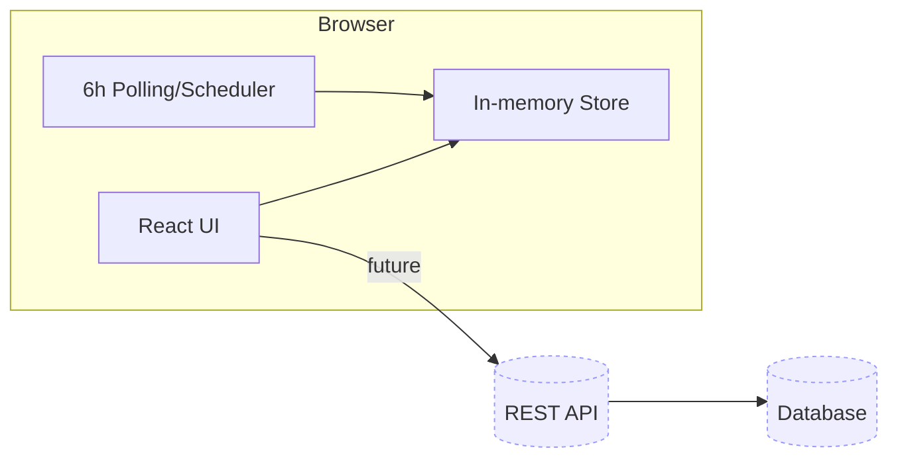
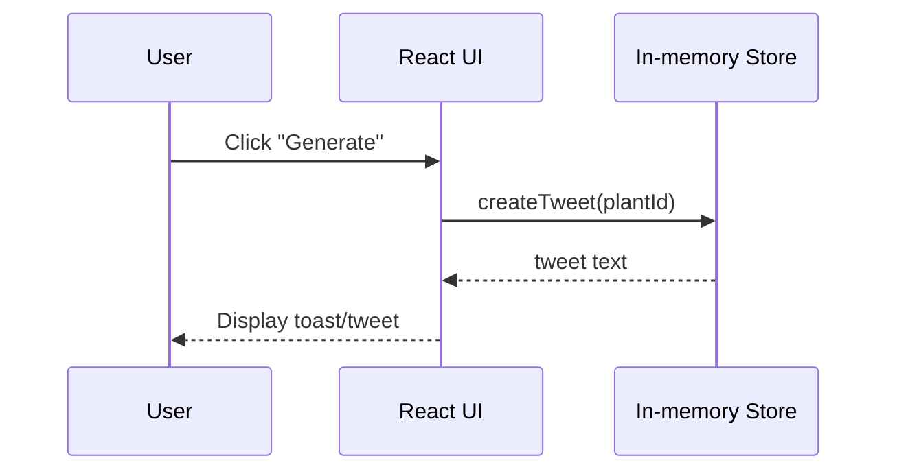
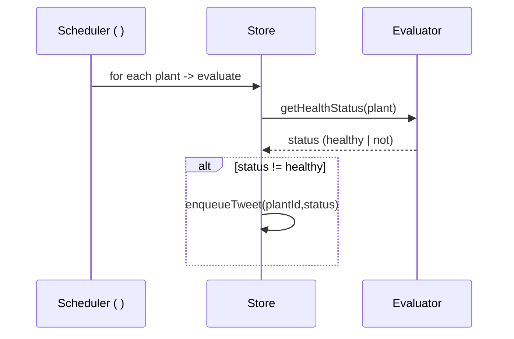

# Architecture

## Logical Components

- **Web UI (React)**: views, forms, tweet generator, scheduler trigger UI
- **Local Store (in-memory)**: plants array, timers
- **(Future) API**: REST endpoints for plants & tweeting
- **(Future) DB**: persistent storage
- **CI/CD**: build/test/deploy to Azure

## Tweet Flow (Ad-hoc)

## Tweet Flow (Scheduled every 6h if unhealthy)

<SwmMeta version="3.0.0">Powered by [Swimm](https://app.swimm.io/)</SwmMeta>
