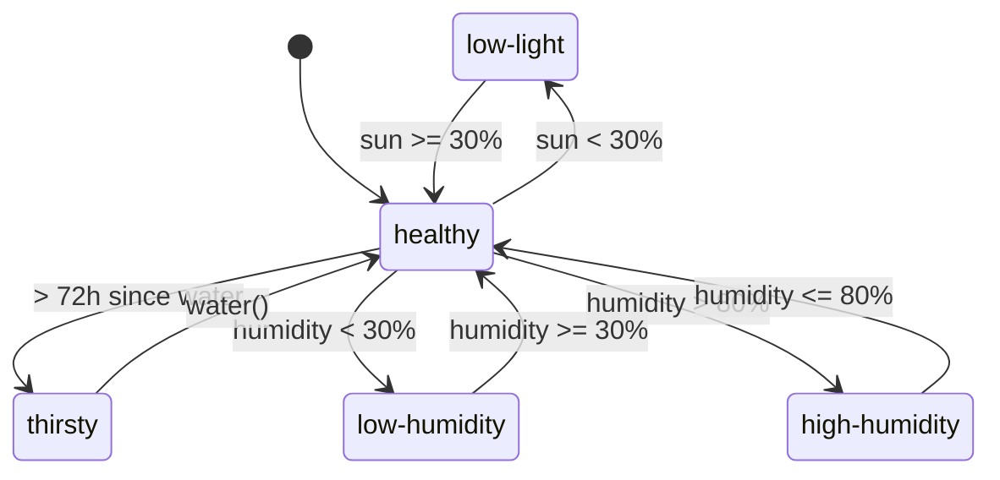

# 🌿 LeafMeAlone

> Your plants are tweeting. And they're not happy about your neglect.

---

## 🪴 Overview

**LeafMeAlone** is a lightweight web app that lets your plants roast you when you forget to water them or give them enough light.\
Each plant tracks its environment, determines its health, and posts developer-humor-filled “tweets” every 6 hours when unhealthy.

---

## ✨ Features

- **Plant Dashboard** — Add and manage multiple plants with custom names, types, and emojis
- **Real-time Monitoring** — Tracks *water*, *light*, and *humidity* for each plant
- **AI-Generated Tweets** — Passive-aggressive developer jokes powered by GPT-4o-mini
- **Auto-Tweet System** — Automatic tweets every 6 hours for unhealthy plants
- **Manual Tweet Generation** — Click “Generate” to instantly trigger a tweet
- **Condition Tracking** — Visual indicators show plant health (💧 thirsty, 🌙 low-light, etc.)

---

## 🌱 How It Works

1. **Add Plants** — Click “Add Plant” and set initial conditions
2. **Monitor Status** — Each card shows water, sun, and humidity levels
3. **Receive Tweets** — Every 6 hours, unhealthy plants tweet reminders
4. **Take Action** — Water plants or adjust light/humidity
5. **Enjoy the Humor** — Laugh (and maybe cry) at passive-aggressive AI sass

---

## 💬 Example Tweets

> - “Still waiting for water like I'm waiting for my PR to be reviewed. Day 3. Send help.”
> - “My light level is lower than my code coverage. At least TDD my watering schedule?”
> - “404: Water Not Found. It’s been 72 hours. Even my leaves are throwing exceptions now.”
> - “You push to main without testing. You forget to water me. I see a pattern.”

Full list → <SwmLink doc-title="TWEET_CATALOG" repo-id="Z2l0aHViJTNBJTNBcGxhbnQtZGFzaGJvYXJkLWFwcCUzQSUzQWVsbWFuYQ==" repo-name="plant-dashboard-app" path="/.swm/tweet_catalog.50zs3btg.sw.md">[TWEET_CATALOG](https://app.swimm.io/repos/Z2l0aHViJTNBJTNBcGxhbnQtZGFzaGJvYXJkLWFwcCUzQSUzQWVsbWFuYQ%3D%3D/docs/50zs3btg)</SwmLink>

---

## 🧠 Plant Health Logic

| Condition         | Trigger                                                                                                                                                                                                                               | Emoji |
| ----------------- | ------------------------------------------------------------------------------------------------------------------------------------------------------------------------------------------------------------------------------------- | ----- |
| **Healthy**       | Default                                                                                                                                                                                                                               | ✨    |
| **Thirsty**       | \> 72 h since last watering                                                                                                                                                                                                           | 💧    |
| **Low-Light**     | Sun < 30 %                                                                                                                                                                                                                            | 🌙    |
| **Low-Humidity**  | Humidity < <SwmToken path="/lib/plant-monitor.ts" pos="23:10:10" line-data="  if (plant.humidity &lt; 30) {" repo-id="Z2l0aHViJTNBJTNBcGxhbnQtZGFzaGJvYXJkLWFwcCUzQSUzQWVsbWFuYQ==" repo-name="plant-dashboard-app">`30`</SwmToken> % | 🏜️    |
| **High-Humidity** | Humidity > <SwmToken path="/lib/plant-monitor.ts" pos="19:10:10" line-data="  if (plant.humidity &gt; 80) {" repo-id="Z2l0aHViJTNBJTNBcGxhbnQtZGFzaGJvYXJkLWFwcCUzQSUzQWVsbWFuYQ==" repo-name="plant-dashboard-app">`80`</SwmToken> % | 💦    |



---

## 🧰 Tech Stack

- **Next.js 15 (App Router)**
- **TypeScript**
- **Tailwind CSS v4**
- **AI SDK (OpenAI GPT-4o-mini)**
- **localStorage** for persistence
- **shadcn/ui components**
- **Azure Static Web Apps Hosting**
- **CI/CD with GitHub Actions**

---

## 🧪 Development

The app uses client-side storage (`localStorage`) and automatically evaluates plant conditions every minute.\
Tweets are generated automatically every 6 hours for unhealthy plants, or manually on demand.

### Run Locally

```bash
npm ci
npm run dev
```

---

## 🧩 Documentation Index

| Section                                                                                                                                                                                                                                                                                                                                             | Description                   |
| --------------------------------------------------------------------------------------------------------------------------------------------------------------------------------------------------------------------------------------------------------------------------------------------------------------------------------------------------- | ----------------------------- |
| <SwmLink doc-title="PRODUCT_OVERVIEW" repo-id="Z2l0aHViJTNBJTNBcGxhbnQtZGFzaGJvYXJkLWFwcCUzQSUzQWVsbWFuYQ==" repo-name="plant-dashboard-app" path="/.swm/product_overview.sgxnmgc2.sw.md">[PRODUCT_OVERVIEW](https://app.swimm.io/repos/Z2l0aHViJTNBJTNBcGxhbnQtZGFzaGJvYXJkLWFwcCUzQSUzQWVsbWFuYQ%3D%3D/docs/sgxnmgc2)</SwmLink>                   | Core concept and user stories |
| <SwmLink doc-title="ARCHITECTURE" repo-id="Z2l0aHViJTNBJTNBcGxhbnQtZGFzaGJvYXJkLWFwcCUzQSUzQWVsbWFuYQ==" repo-name="plant-dashboard-app" path="/.swm/architecture.b94mhe3o.sw.md">[ARCHITECTURE](https://app.swimm.io/repos/Z2l0aHViJTNBJTNBcGxhbnQtZGFzaGJvYXJkLWFwcCUzQSUzQWVsbWFuYQ%3D%3D/docs/b94mhe3o)</SwmLink>                               | Components & data flow        |
| <SwmLink doc-title="DOMAIN_MODEL" repo-id="Z2l0aHViJTNBJTNBcGxhbnQtZGFzaGJvYXJkLWFwcCUzQSUzQWVsbWFuYQ==" repo-name="plant-dashboard-app" path="/.swm/domain_model.uf09bj86.sw.md">[DOMAIN_MODEL](https://app.swimm.io/repos/Z2l0aHViJTNBJTNBcGxhbnQtZGFzaGJvYXJkLWFwcCUzQSUzQWVsbWFuYQ%3D%3D/docs/uf09bj86)</SwmLink>                               | Entities and relationships    |
| [State Machine](docs/STATE_MACHINE.md)                                                                                                                                                                                                                                                                                                              | Health transitions            |
| [API Design (planned)](docs/API_DESIGN.md)                                                                                                                                                                                                                                                                                                          | REST endpoints draft          |
| [CI/CD Pipeline](docs/CI_CD.md)                                                                                                                                                                                                                                                                                                                     | Build & deploy                |
| [Security (planned)](docs/SECURITY.md)                                                                                                                                                                                                                                                                                                              | Auth roadmap                  |
| <SwmLink doc-title="ROADMAP" repo-id="Z2l0aHViJTNBJTNBcGxhbnQtZGFzaGJvYXJkLWFwcCUzQSUzQWVsbWFuYQ==" repo-name="plant-dashboard-app" path="/.swm/roadmap.vb4wl5bd.sw.md">[ROADMAP](https://app.swimm.io/repos/Z2l0aHViJTNBJTNBcGxhbnQtZGFzaGJvYXJkLWFwcCUzQSUzQWVsbWFuYQ%3D%3D/docs/vb4wl5bd)</SwmLink>                                              | Release and growth plan       |
| <SwmLink doc-title="TWEET_CATALOG" repo-id="Z2l0aHViJTNBJTNBcGxhbnQtZGFzaGJvYXJkLWFwcCUzQSUzQWVsbWFuYQ==" repo-name="plant-dashboard-app" path="/.swm/tweet_catalog.50zs3btg.sw.md">[TWEET_CATALOG](https://app.swimm.io/repos/Z2l0aHViJTNBJTNBcGxhbnQtZGFzaGJvYXJkLWFwcCUzQSUzQWVsbWFuYQ%3D%3D/docs/50zs3btg)</SwmLink>                            | Full tweet list               |
| <SwmLink doc-title="CHANGELOG" repo-id="Z2l0aHViJTNBJTNBcGxhbnQtZGFzaGJvYXJkLWFwcCUzQSUzQWVsbWFuYQ==" repo-name="plant-dashboard-app" path="/.swm/changelog.erymvk8b.sw.md">[CHANGELOG](https://app.swimm.io/repos/Z2l0aHViJTNBJTNBcGxhbnQtZGFzaGJvYXJkLWFwcCUzQSUzQWVsbWFuYQ%3D%3D/docs/erymvk8b)</SwmLink>                                        | Version history               |
| <SwmLink doc-title="RELEASE_NOTES_TEMPLATE" repo-id="Z2l0aHViJTNBJTNBcGxhbnQtZGFzaGJvYXJkLWFwcCUzQSUzQWVsbWFuYQ==" repo-name="plant-dashboard-app" path="/.swm/release_notes_template.du2b7zmo.sw.md">[RELEASE_NOTES_TEMPLATE](https://app.swimm.io/repos/Z2l0aHViJTNBJTNBcGxhbnQtZGFzaGJvYXJkLWFwcCUzQSUzQWVsbWFuYQ%3D%3D/docs/du2b7zmo)</SwmLink> | Future releases               |
| <SwmLink doc-title="CONTRIBUTING" repo-id="Z2l0aHViJTNBJTNBcGxhbnQtZGFzaGJvYXJkLWFwcCUzQSUzQWVsbWFuYQ==" repo-name="plant-dashboard-app" path="/.swm/contributing.lh0iea8e.sw.md">[CONTRIBUTING](https://app.swimm.io/repos/Z2l0aHViJTNBJTNBcGxhbnQtZGFzaGJvYXJkLWFwcCUzQSUzQWVsbWFuYQ%3D%3D/docs/lh0iea8e)</SwmLink>                               | Dev guidelines                |
| <SwmLink doc-title="CONFIGURATION" repo-id="Z2l0aHViJTNBJTNBcGxhbnQtZGFzaGJvYXJkLWFwcCUzQSUzQWVsbWFuYQ==" repo-name="plant-dashboard-app" path="/.swm/configuration.irz1fqu4.sw.md">[CONFIGURATION](https://app.swimm.io/repos/Z2l0aHViJTNBJTNBcGxhbnQtZGFzaGJvYXJkLWFwcCUzQSUzQWVsbWFuYQ%3D%3D/docs/irz1fqu4)</SwmLink>                            | Environment variables         |

---

## 🚀 Road Ahead

- Add auth (Azure Entra ID / B2C)
- Introduce API + DB (PostgreSQL/Azure SQL)
- Scheduled Azure Function for tweets
- Real IoT sensor integration
- Social posting (X/Mastodon)

---

> 💚 **Motto:** “Ship water, not features.”

<SwmMeta version="3.0.0"><sup>Powered by [Swimm](https://app.swimm.io/)</sup></SwmMeta>
