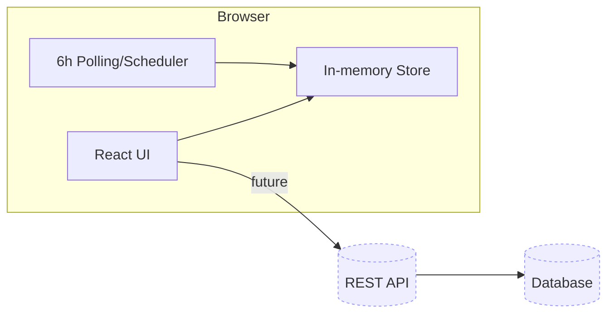
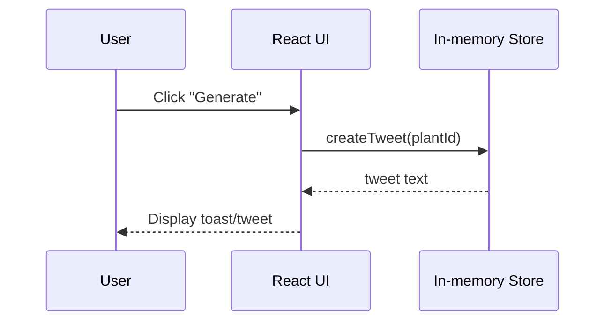
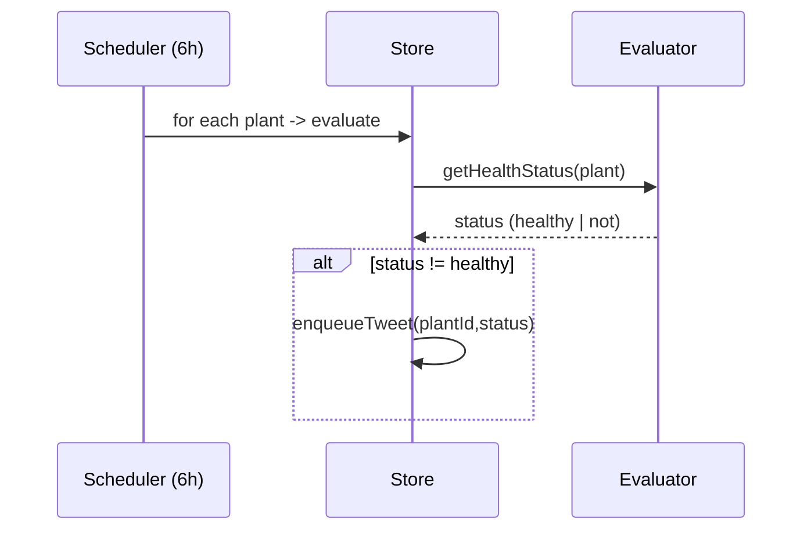

# Architecture

## Logical Components
- **Web UI (React)**: views, forms, tweet generator, scheduler trigger UI
- **Local Store (in-memory)**: plants array, timers
- **(Future) API**: REST endpoints for plants & tweeting
- **(Future) DB**: persistent storage
- **CI/CD**: build/test/deploy to Azure

## Tweet Flow (Ad-hoc)

Notes (ad-hoc):
- Tweet content for ad-hoc generation is sourced from lib/pre-generated-tweets.ts (symbol: preGeneratedTweets). See that module for the canonical collection and any selection/rotation logic.
- The Plant type has been updated in lib/types.ts and no longer includes an owner field. Architecture and UI flows must not assume a Plant.owner property exists.
- If any routing or notification delivery previously relied on Plant.owner, update the routing mechanism to the current approach. Implementation details are not present in this document; TODO: link the notification/routing implementation or issue and record the replacement mechanism (see lib/types.ts and lib/pre-generated-tweets.ts).

## Tweet Flow (Scheduled every 6h if unhealthy)

Notes (scheduled):
- Scheduled tweets (enqueued when a plant is evaluated as unhealthy) use the same tweet reservoir: lib/pre-generated-tweets.ts (preGeneratedTweets).
- The Plant model (lib/types.ts) no longer contains an owner field. Scheduled flows should not attempt to read Plant.owner for delivery or routing.
- If scheduled notifications must reach a specific user or external endpoint, the current routing/delivery mechanism must be verified and updated as necessary. TODO: document the replacement routing approach and link to the scheduler/enqueue implementation or an issue tracking this change (see lib/types.ts and lib/pre-generated-tweets.ts).
